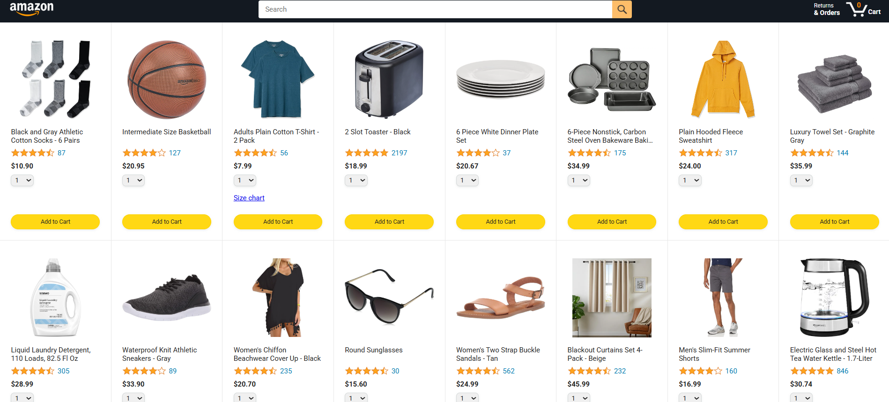
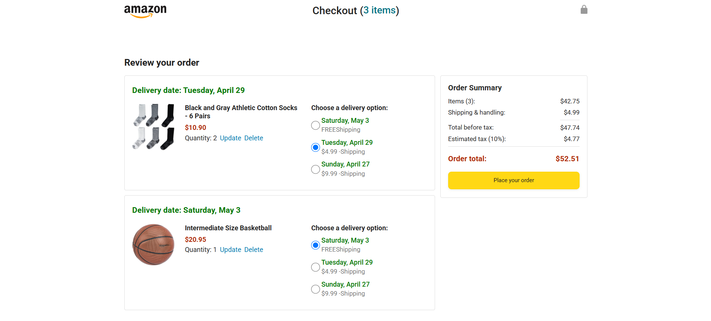
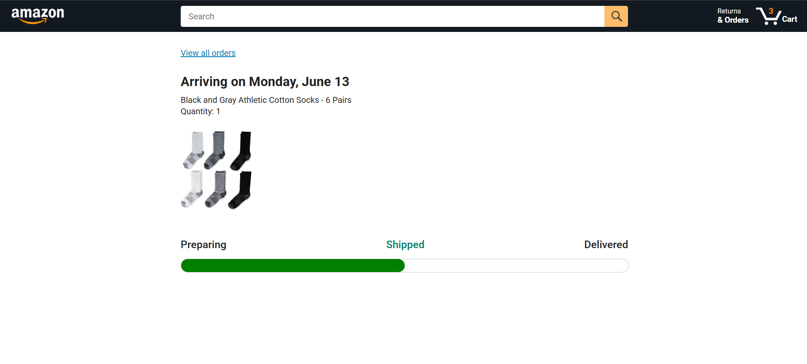
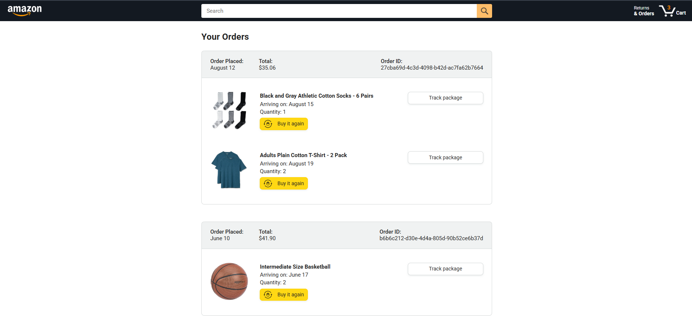

🛒 JavaScript Amazon Clone

A fully functional and responsive Amazon-like e-commerce website built using HTML, CSS, and JavaScript. This project emulates core functionalities of an online shopping platform, including product listings, shopping cart, checkout process, order tracking, and more.

🚀 Features

Dynamic Product Listings: Display products with images, prices, and descriptions.
Shopping Cart Functionality: Add, remove, and update product quantities in the cart.
Checkout Process: Simulate a checkout flow with order summary.
Order Tracking: Track orders with a dedicated tracking page.
Responsive Design: Optimized for various screen sizes, including desktops, tablets, and mobiles.
Modular Code Structure: Organized codebase with separation of concerns for scalability.

🛠️ Technologies Used

HTML5: Markup structure.
CSS3: Styling and layout.
JavaScript (ES6+): Interactivity and dynamic content manipulation.

## 📸 Screenshots

### 🏠 Home Page Preview

---

### 🛒 Cart Page Preview

---

### 🚚 Track Your Order Page Preview

---

### 📦 Orders Page Preview

📌 Future Enhancements

User Authentication: Implement login and registration functionality.
Payment Integration: Integrate payment gateways for real transactions.
Database Connectivity: Connect to a database to store user and order information.
Admin Panel: Create an interface for managing products and orders.

🤝 Contributing

Contributions are welcome! If you have suggestions or improvements, feel free to fork the repository and submit a pull request.
